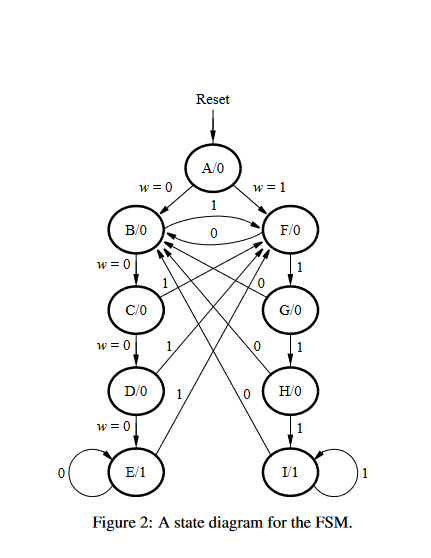

# Aula 08

## Parte 1 - Máquina de estados para sequências repetidas:

Nesta parte implementamos uma máquina de estados que identifica quando uma entrada teve ser valor repetido durante um período de clock. Por exemplo, se o switch W estiver mantido como 0 durante 4 ou mais estados de clock, o usuário será alertado por meio de um led. O mesmo ocorre para quando w = 1. O funcionamento desse mecanismo se baseia em uma maquina de estados, que ao ter o mesmo valor que o estado anterior envia-o para outro estado e ao ter o estado contrário ao ciclo anterior retorna ao estado inicial.

Segue uma ilustração do funcionamento: 

## Parte 4 - Tradutor Morse usando máquina de estados:

Nesta parte implementamos um tradutor morse usando uma máquina de estados. O circuito recebe uma letra do alfabeto entre A e H e retorna como output o seu respectivo código morse. Segue a tabela morse para cada uma das letras:

